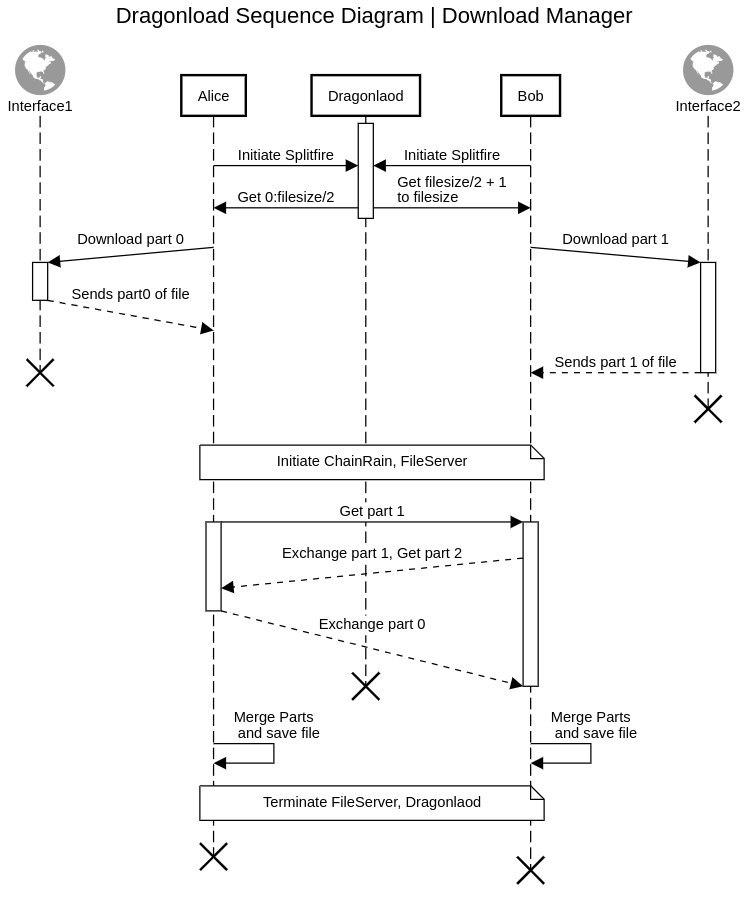
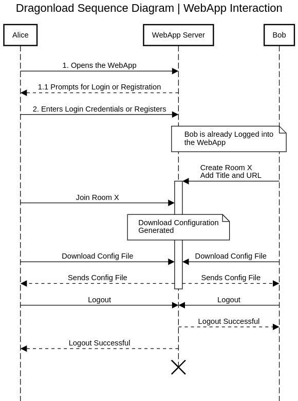

Dragonload Distributed Download Manager
=========================


MacOS/Linux: build|Passing

Developed by Team Madcaps

Download
--------
Head over to out Source Repo and clone the project

git clone github.com/sayoojsamuel/dragonload
cd dragonload

Installation
--------
python setup.py install

Developer Mode
--------
python setup.py develop

Sample Config File
--------

```python
from dragonload.dragonload import startDragonload

url = "http://www.google.com/movies/security.mp4"
user_count = 2
user_id = 0 # set 1 in other user
user_list = [(0, "192.168.29.108"), (1, "192.168.29.194")]
startDragonload(url, user_count, user_id, user_list)
```

Download Engine Sequence Diagram
--------


Web App User Engagements
--------


# Table of Contents

1.  [dragonload Distributed Downlaod Manager](#orgbd7b2f9)
    1.  [Tasks](#orge010a22)
    2.  [Tesing](#org8523abe)
    3.  [Protocol](#orgc4c4e83)
        1.  [Splitfire Protocol](#org3a8fc9d)
        2.  [ChainRain Protocol](#org86c1216)
        3.  [Dragonvault Protocol](#orgbf45f1c)
    4.  [Ideas](#org1022ce9)
        1.  [Simustaneous running of Splitfile and ChainRain in pipeline](#org32f5fd2)
        2.  [Add MultiThreaded Download for individual parts](#org9ca9749)
        3.  [Authenticated Private Rooms](#org403f71c)
        4.  [curses based application](#org22a9628)
        5.  [Use click and pyinquirer, prompt-toolkit](#orgc739649)
        6.  [Use grpc for client, server, and all comms](#org0b7d369)
    5.  [Necessary Reads](#orge1339ed)
        1.  [Pathlib: Article to make os independent paths](#org993fe62)
        2.  [py<sub>cui</sub>: alternative to ncurses](#orge1e3803)
    6.  [ISSUES:](#orgb8fe609)
    7.  [ENHANCEMENTS:](#org0dbe582)


<a id="orgbd7b2f9"></a>

# Project Board


<a id="orge010a22"></a>

## Tasks

-   [-] Design a robust backend
-   [-] Manage the protocol
-   [ ] Create a config directory in POSIX and MAC machines. This about NS
    machines later. Config directory is necessary to store the db and the config
    file. DB is necessary for the downloading to happen. Also fix the directory
    where the downloading happens. Parital downloads in the temp directory or the
    main download directory.
-   [ ] Test the platform
-   [ ] Try to convert the commands to python only; platform independance


<a id="org8523abe"></a>

## Tesing

-   [-] Check for partial download
-   [ ] Test the merge functionality


<a id="orgc4c4e83"></a>

## Protocol


<a id="org3a8fc9d"></a>

### Splitfire Protocol

This protocol is responsible for managing all the interested parties into one
pool.

1.  Objective

    -   Create Pool for interested Parties; N party proto
    -   Check the file size;
    -   Split the fileSize by a multiple of N
    -   Collect user IP&rsquo;s
    -   Generate the download script. Notify the CNC after each successful download;
        Realtime progress for the pool
    -   Schedule Download??? Take care of the sleep
    -   Manage Parties who leave in between the protocol
    -   Split part of the remaining itemsList to the newcomming member; Dynamic Pool
        Model
    -


<a id="org86c1216"></a>

### ChainRain Protocol

This protocol is for efficiently sharing the files after partly download among
the decorated users.

1.  Objectives

    -   Verify if parties are still active during the process
    -   Check connection with the CNC
    -   Share files parallely, efficiently and equally among the users. (check for
        corruptions)
    -   Test if local hosting is proper
    -   Share in a binary Tree manner - Will it work out?
    -   Merge the parts as and when they arrive. Notify other about the status of the
        proces


<a id="orgbf45f1c"></a>

### Dragonvault Protocol

This is the main server application, which will handle the whole download
manager.  This can be implemented in two ways:

-   A centralized main server
-   A requirement based


<a id="org1022ce9"></a>

## Ideas


<a id="org32f5fd2"></a>

### [ ] Simustaneous running of Splitfile and ChainRain in pipeline


<a id="org9ca9749"></a>

### [ ] Add MultiThreaded Download for individual parts


<a id="org403f71c"></a>

### [ ] Authenticated Private Rooms


<a id="org22a9628"></a>

### [X] curses based application


<a id="orgc739649"></a>

### [ ] Use click and pyinquirer, prompt-toolkit


<a id="org0b7d369"></a>

### [ ] Use grpc for client, server, and all comms

1.  [ ] Create robust framework, and build curses app, web app on top


<a id="orge1339ed"></a>

## Necessary Reads


<a id="org993fe62"></a>

### [Pathlib](https://medium.com/@ageitgey/python-3-quick-tip-the-easy-way-to-deal-with-file-paths-on-windows-mac-and-linux-11a072b58d5f): Article to make os independent paths


<a id="orge1e3803"></a>

### [py<sub>cui</sub>:](https://github.com/jwlodek/py_cui) alternative to ncurses


<a id="orgb8fe609"></a>

## ISSUES:

-   [ ] Fix the port issue. Update the server with the users port address in
    addition to the IP address.  Code everything in <span class="underline"><span class="underline">main</span></span> file.


<a id="org0dbe582"></a>

## ENHANCEMENTS:

-   [ ] Use python dataclasses
-   [ ] Make a custom URI scheme (dragon://)
-   [ ] Gossip framework for status sharing??
